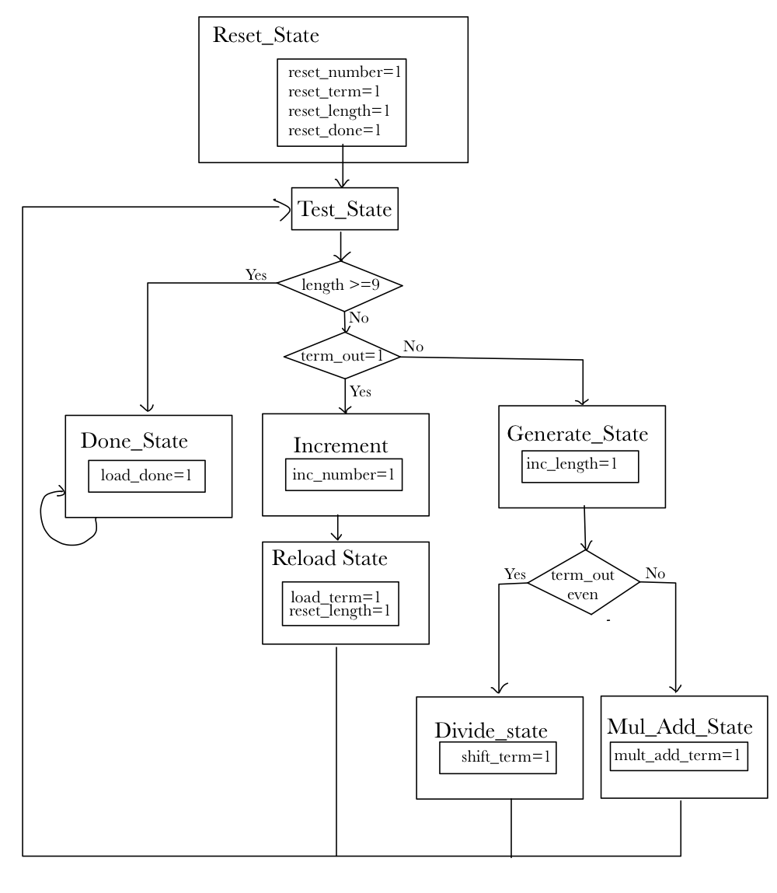
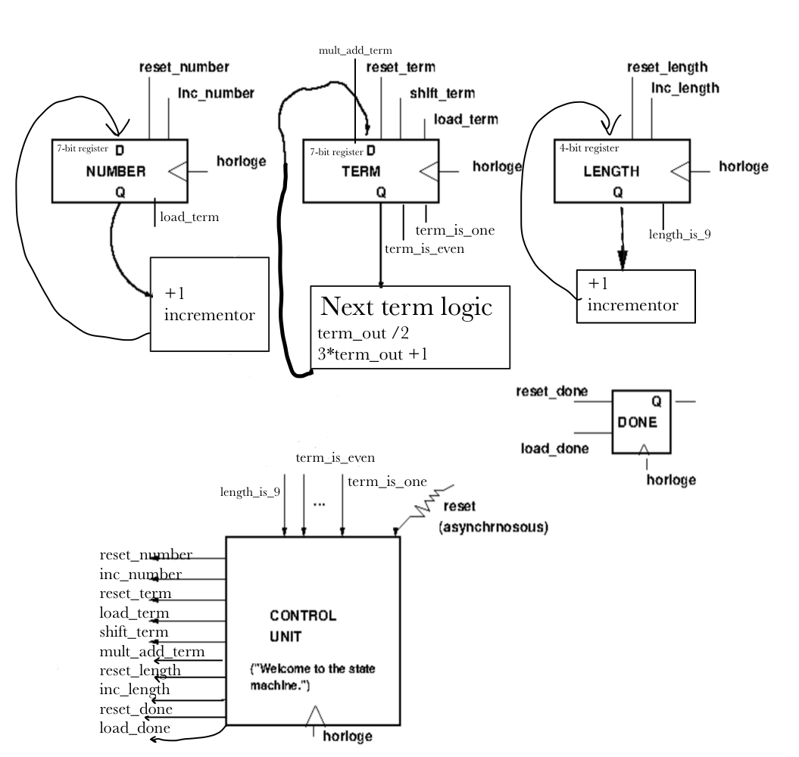
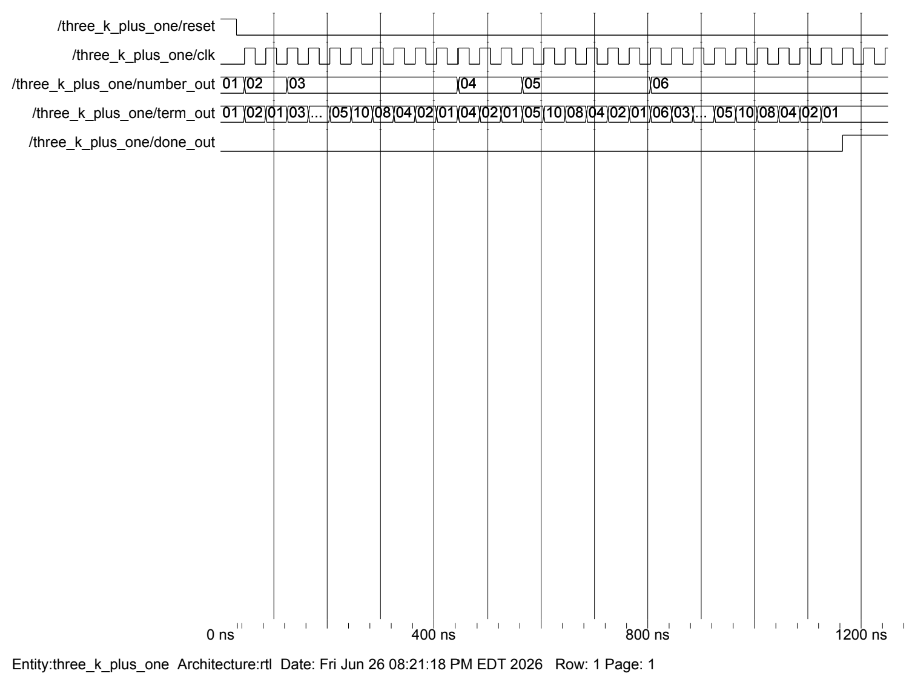
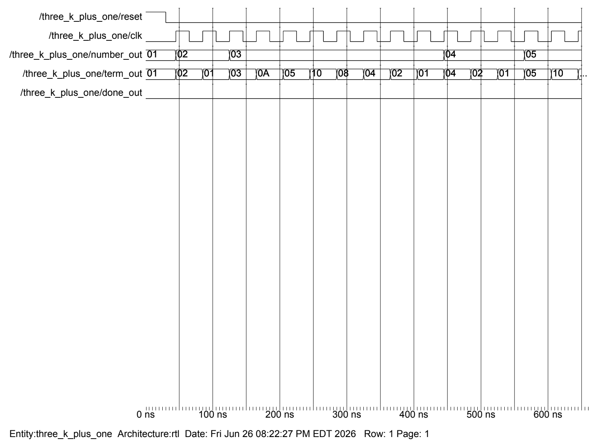
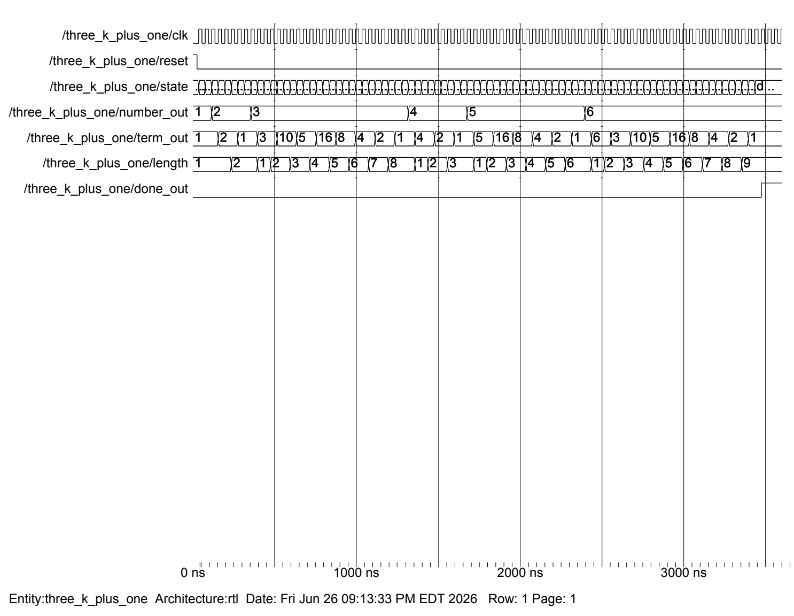
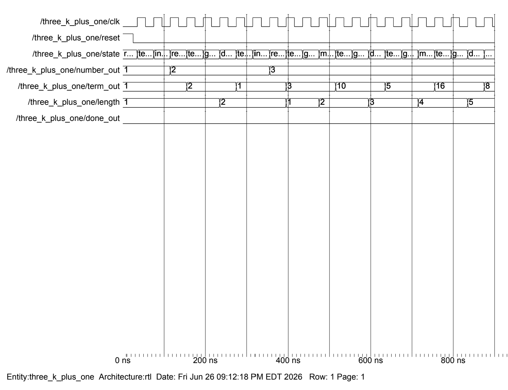
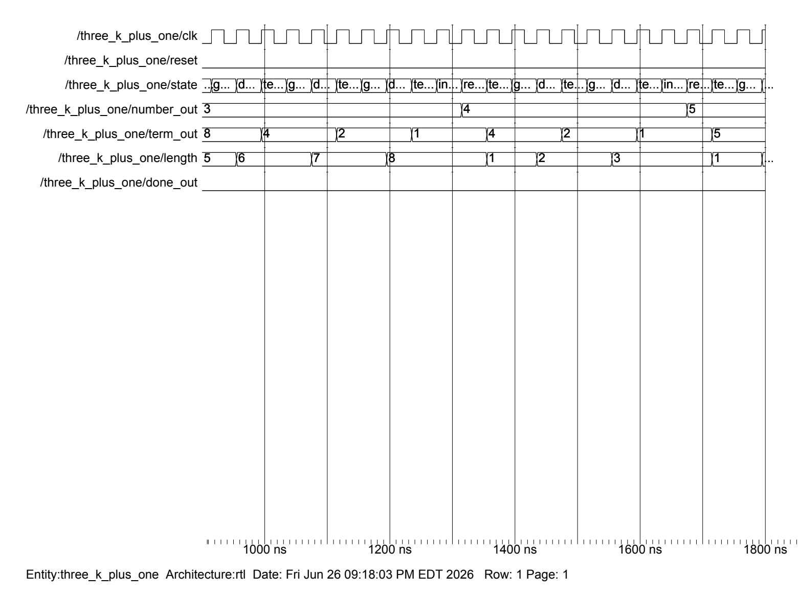
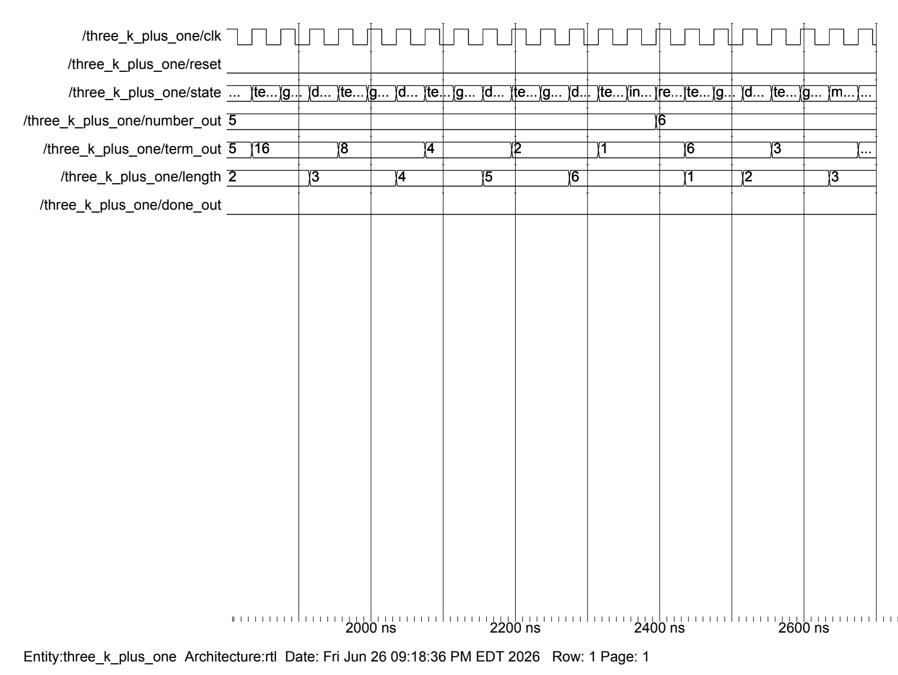
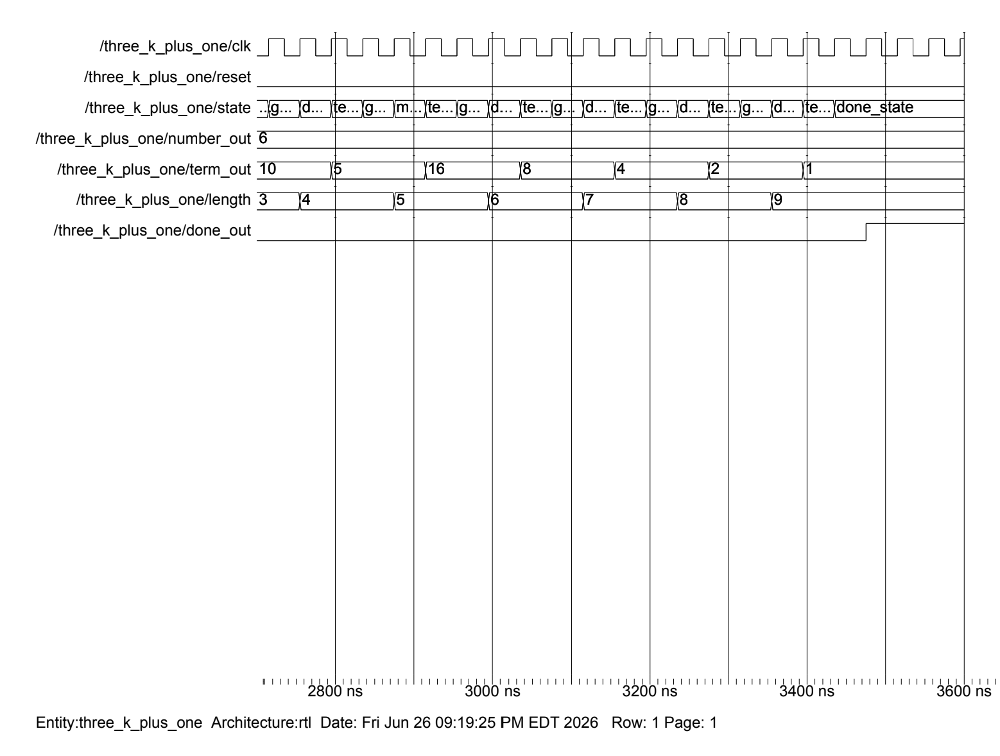

# 3k+1 (Collatz) Sequence Finder on FPGA — VHDL

Hardware implementation of the **3k+1 (Collatz) algorithm** in VHDL, built two ways and run on a 100 MHz FPGA board with a multiplexed seven-segment display.

The circuit searches for the **smallest starting number whose 3k+1 sequence has at least 9 terms**. It steps through starting numbers 1, 2, 3, … and generates each sequence one term per slow-clock tick. When a sequence reaches length 9, it raises `done_out` and freezes the result on the display.

**Result:** the answer is **6**, whose sequence is `6 → 3 → 10 → 5 → 16 → 8 → 4 → 2 → 1` (9 terms).

> Course project for COEN 313, *Digital Systems Design II*, at Concordia University.

---

## The two designs

| | Part 1: Single clocked process | Part 2: ASM (control unit + datapath) |
|---|---|---|
| Source | [`src/part1_single_process/three_k_plus_one.vhd`](src/part1_single_process/three_k_plus_one.vhd) | [`src/part2_asm/three_k_plus_one_asm.vhd`](src/part2_asm/three_k_plus_one_asm.vhd) |
| Structure | All algorithm logic in one clocked `process` | 8-state FSM driving separate `number`, `term`, `length` and `done` registers |
| Cycles per term | 1 | ~3 (test → generate → divide / multiply-add) |
| Relative speed | Baseline | ~3× slower, but it maps cleanly onto an ASM chart and datapath |

### The algorithm

```
number := 1; term := 1; length := 1
loop:
    if length >= 9:           done            -- answer found
    elif term == 1:           number += 1; term := number; length := 1
    elif term is even:        term := term / 2;      length += 1   -- right shift
    else:                     term := 3*term + 1;    length += 1
```

### Part 2: ASM chart and datapath

<p align="center">
  
  
</p>

The states are `reset_state → test_state → {increment → reload_term | generate_state → {divide_state | mult_add_state}} → test_state …`, ending in `done_state`. The control unit sends control signals such as `inc_number`, `load_term`, `shift_term`, `mult_add_term`, `inc_length` and `load_done` to the datapath. The datapath sends back the status signals `term_is_one`, `term_is_even` and `length_is_9`.

---

## Shared hardware blocks

Both designs share the same I/O structure:

- **Clock divider:** divides the 100 MHz board clock (`clk_in`) down to about 1 Hz, so each step is visible on the board (`CLK_DIV_MAX = 49_999_999`).
- **Display refresh counter:** an 18-bit free-running counter. Its top 2 bits select which digit is active.
- **Binary → BCD converter:** subtracts 10 repeatedly to split the 7-bit `term_out` into tens and ones digits.
- **7-segment mux and decoder:** active-low anodes (`an`) and segments (`sseg`). The decimal point is off.

### Ports

| Port | Dir | Width | Description |
|---|---|---|---|
| `clk_in` | in | 1 | 100 MHz board clock |
| `reset` | in | 1 | Asynchronous, active-high reset |
| `an` | out | 8 | Seven-segment anode enables (active low) |
| `sseg` | out | 8 | Segments a–g plus decimal point (active low) |
| `done_out` | out | 1 | High once the answer is found (e.g. drive an LED) |

### Display layout

| Digit | Shows |
|---|---|
| 0 (rightmost) | Current term, ones digit |
| 1 | Current term, tens digit |
| 2 | Current starting number |

---

## Simulation

Simulating the real 1 Hz clock would take far too long, so set these constants before simulating (each is marked in the source comments):

```vhdl
constant CLK_DIV_MAX : integer := 1;   -- 49999999 on hardware
constant N           : integer := 4;   -- 18 on hardware
```

**Part 1: full simulation.** `done_out` goes high when `number_out = 6` and `length = 9`.



<details>
<summary>More waveforms</summary>

**Part 1: partial simulation**


**Part 2: full simulation**


**Part 2: state-by-state waveforms**




</details>

The waveforms above come from ModelSim. You can also check both files with the open-source [GHDL](https://github.com/ghdl/ghdl):

```bash
ghdl -a --std=08 src/part1_single_process/three_k_plus_one.vhd
ghdl -a --std=08 src/part2_asm/three_k_plus_one_asm.vhd
```

---

## Synthesis (Vivado)

Both designs were synthesized, implemented and loaded onto the board as bitstreams. The full RTL component reports are in [`synthesis/`](synthesis/).

| Resource | Part 1 | Part 2 (ASM) |
|---|---|---|
| Registers | 26-bit ×1, 7-bit ×2, 4-bit ×1, 1-bit ×2 | *same* |
| 2-input 7-bit adders | 11 | 10 |
| Muxes (total instances) | 14 | 29 |

Both versions have the same registers, because they store the same values: the clock divider, `number_out`, `term_out`, `length` and `done`. The ASM version adds more multiplexers, because the FSM's control signals choose each register's next value.

To build on hardware, add both `.vhd` files to a Vivado project, but only one at a time, since they are separate top-level designs. Then add a constraints (`.xdc`) file that maps `clk_in`, `reset`, `an`, `sseg` and `done_out` to your board's pins.

---

## Repository layout

```
.
├── src/
│   ├── part1_single_process/three_k_plus_one.vhd   # single-process design
│   └── part2_asm/three_k_plus_one_asm.vhd          # ASM / FSM + datapath design
├── synthesis/                                      # Vivado RTL component statistics
└── docs/images/                                    # waveforms, ASM chart, datapath, build screenshots
```

## Author

Victoria Genyuk
